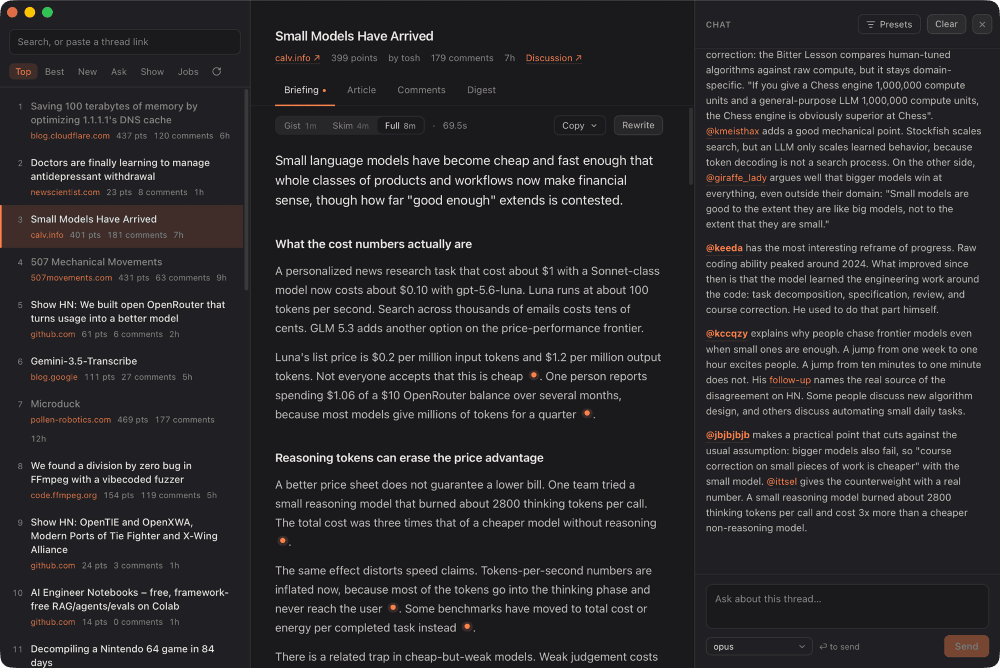

<div align="center">
  
  <h1>Rundown</h1>
  <p>A Hacker News client that summarises long threads and lets you chat with them.</p>
  <p>
    <a href="https://github.com/nilbuild/rundown/releases/latest"></a>
    <a href="https://github.com/nilbuild/rundown/releases/latest"></a>
    <a href="https://github.com/nilbuild/rundown/releases/latest"></a>
    <a href="LICENSE"></a>
  </p>
  
</div>

A decent HN post can have 800 comments hanging off a 4,000 word article. Somewhere in
there are the four things worth knowing, and the only way to find them is to read the lot.

Rundown gives you the short version: what the article says, what the thread argued with it
about, and a chat you can point at either. Every quote keeps the comment it came from and
gets checked against the thread first, so you can go and read the real thing when it
matters.

It runs on the `claude` or `codex` CLI you already have installed, so it uses the
subscription you are signed in to. Nothing is stored anywhere but your own machine.

## Features

- **Briefing**: article and thread as one account, at three reading depths
- **Digest**: the discussion as an outline, each point backed by quotes
- **Chat**: ask about the thread; it is already loaded
- **Library**: search what you have read, or synthesise several threads at once
- **Reader**: the linked article as clean markdown

## Install

[Download the latest release](https://github.com/nilbuild/rundown/releases/latest) —
a universal `.dmg` on macOS, an installer on Windows, `.AppImage` or `.deb` on Linux.
It updates itself after that.

Needs [Claude Code](https://claude.com/claude-code) or the
[Codex CLI](https://developers.openai.com/codex/cli) installed and signed in.

## Building it

```sh
pnpm install
pnpm tauri dev      # run
pnpm tauri build    # build the app
```

## License

[MIT](LICENSE) © Kamran Ahmed
